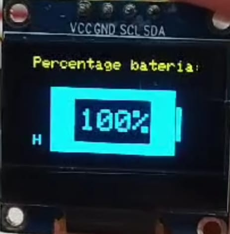

# Tests

This folder contains a set of small Arduino sketches I wrote during my first year on the university and on the university robotics team. The exercises were assigned so I could learn how to connect and program the hardware components used in the secondary robots for the Eurobot 2024 competition. These sketches are intentionally simple: they are utility/testing programs to verify individual components, and they also served as the building blocks for the private final routines developed by the team (those final routines are not public).

Because these examples are very basic and educational, I'm happy to share them here as part of my portfolio. At the time I started this work I came from a Python background, so these sketches were also my way of learning C/C++ for microcontrollers. The examples increase in complexity as you go through the folder, from simple switch and timing tests up to a small use of classes for the OLED display.

Important note on privacy
-------------------------
The sketches in this folder are component tests and demos. The team’s final routines and higher-level strategies are private and not included here. These files show low-level, introductory code only.

Contents
--------
- `DC_velocity_tester` — Test sketch for DC motor velocity. Use this to verify motor response and basic velocity behavior.
- `L298N_tester` — Simple tester for an L298N motor driver (basic motor control and direction tests).
- `Limit_switch_tester` — Reads and debounces a limit/safety switch for mechanical tests.
- `Millis_test` — Example of non-blocking timing using `millis()` instead of `delay()`.
- `Oled_display_tester` — Tests OLED display functions. The sketch displays the battery percentage and the current field color (H for homologation / B for blue / Y for yellow) on the screen.
- `Servo_tester` — Basic servo movement and calibration sketch.
- `Switch_tester` — Simple sketch to test push-buttons and switches.
- `Ultrasonic_tester` — Distance measurement using an ultrasonic sensor (HC‑SR04).

Prerequisites
-------------
- Arduino IDE (or compatible editor).
- Select the correct board and serial port in the IDE before uploading.
- Install libraries when required:
  - `Oled_display_tester` — Requires:
    - `Adafruit_GFX`
    - `Adafruit_SSD1306`

Hardware notes
--------------
- Before uploading code, verify that the pin assignments in the sketch match your hardware wiring and that all connections are secure.
- If a sketch uses `analogReference(EXTERNAL)`, ensure you actually provide the external reference voltage in hardware; otherwise use `DEFAULT`.
- Do not power motors or servos from USB or the Arduino 5V regulator while the board is connected to a computer. Instead, use a dedicated external power supply and connect the grounds for your computer's safety.

How to use
----------
1. Open the corresponding `.ino` file in the Arduino IDE.
2. Check the top-of-file comments for pin assignments and required connections.
3. Select the board and COM port, then click Upload.
4. Open the Serial Monitor (baud rate shown in the sketch, typically 9600) to view debug output.

Oled display image
------------------

  

License & contact
-----------------
These sketches are educational examples I developed. If you need more details about wiring or to discuss a particular sketch, feel free to contact me via my GitHub profile.
